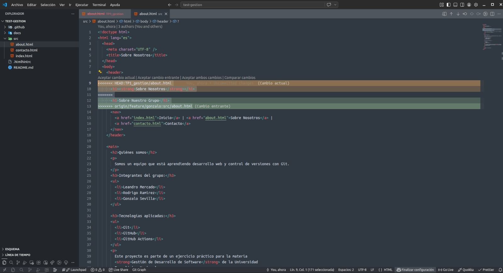
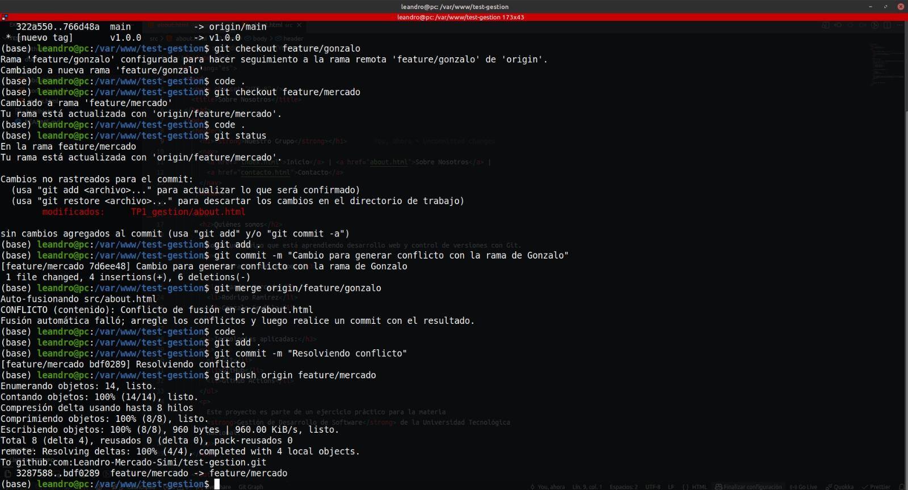
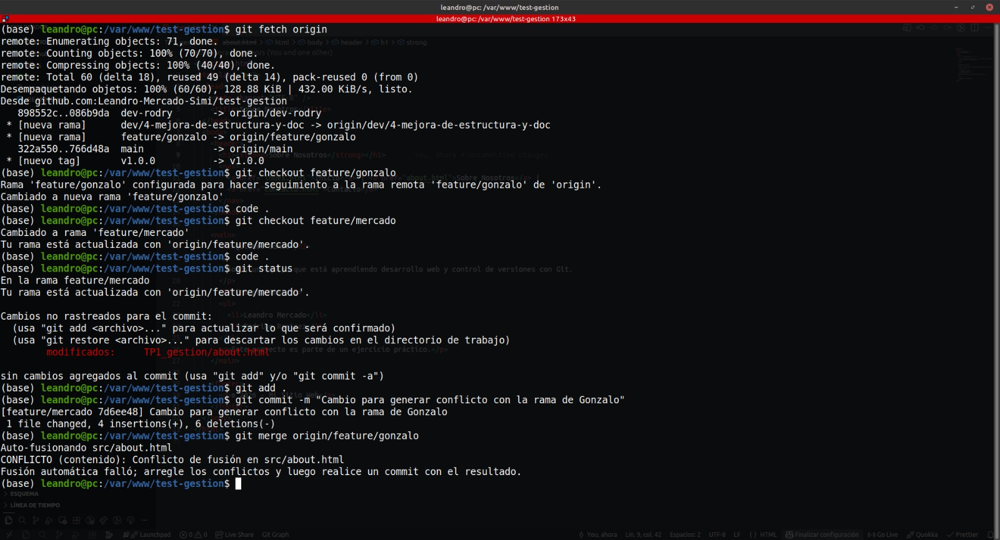

# Trabajo Practico Integrador - Git Avanzado

## Tecnicatura Universitaria en Programación - UTN

### Integrantes

- Mercado, Leandro
- Ramirez, Rodrigo
- Sevilla, Gonzalo
  
### Tecnologias aplicadas

- Git
- GitHub
- GitHub Actions

### Capturas de pantalla

Resoluciones de Conflictos:

Merge final con solucion

Action con falla y exitosa

